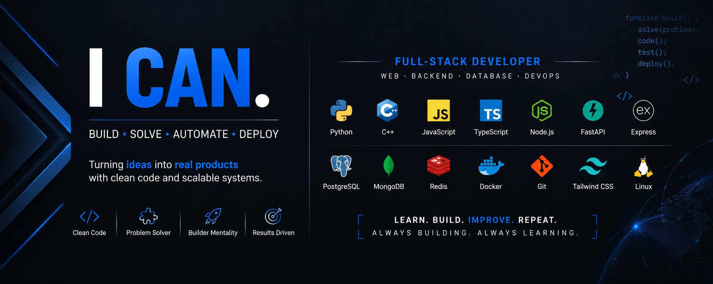

<h1 align="center">Hi, I'm Fraol 👋</h1>

Full-stack developer bridging mechanical engineering and software — Python-first, building across web, ML, and game dev.

## 💫 About Me

Full-stack developer with 3+ years of self-taught, project-based experience across Python, JavaScript, and C++. Final-year Mechanical Engineering student at Addis Ababa Science and Technology University (AASTU), which shapes my interest in automation — combining mechanical systems with software.

I build RESTful APIs, work across relational and NoSQL databases, and I'm currently deepening into machine learning and game development. Recent work spans microservices, distributed monoliths, and event-driven systems using Redis pub/sub.

- 🔭 Currently building **Guzolink** — a merchant marketplace platform (Node/Express/MongoDB, React)
- 🧠 Also working on **PromptCrafter** — a deployed AI SaaS tool for restructuring prompts
- 🎮 Exploring game dev with **Creation Engine**, using Godot/GDScript
- 🌱 Learning: machine learning fundamentals, distributed systems patterns
- 🗣️ Languages: Afaan Oromo, Amharic, English

## 🚀 Featured Projects

| Project | Description | Stack |
|---|---|---|
| **[Guzolink](https://github.com/FIBA00/Guzolink)** | Merchant-to-merchant bulk shopping ecommerce platform. Lead backend/integration developer. | Node.js, Express, MongoDB, React (Vite), Tailwind, Stripe, Docker |
| **[PromptCrafter](#)** | Deployed AI SaaS tool for rearranging and restructuring prompts via templates or AI. | Tailwind CSS, JavaScript |
| **[Booky](https://github.com/FIBA00/Booky)** | Full-stack bookstore application. | React |
| **[fitique](https://github.com/FIBA00/fitique)** | Multi-tenant boutique platform with virtual wardrobe fit-checking before purchase. | React |
| **[LearnEasy](https://github.com/FIBA00/LearnEasy)** | Learning platform that maps new programming languages to ones you already know. | React, MongoDB, PostgreSQL |
| **[LibraryManagementSystem](https://github.com/FIBA00/LibraryManagementSystem)** | Library management system. | Multi tenant public and private library management  |
| **[Cakely](https://github.com/FIBA00/Cakely)** | Custom cake ordering platform for cake shop owners. | — |
| **[tiri](https://github.com/FIBA00/tiri)** | | — |
| **[Yehidat](https://github.com/FIBA00/Yehidat)** | Suprise your family and friends with single call ! | — |
| **[Creation Engine](#)** | Game-focused project exploring engine-level systems. | Godot, GDScript |

## 🎓 Certifications

- Python — Udemy (Federico Azzurro)
- Data Analysis Fundamentals Nanodegree — Udacity
- Java Programming — Handong Global University UNESCO UNITWIN (via AASTU)
- ChatGPT / Generative AI — Handong Global University UNESCO UNITWIN (via AASTU)

### 🌐 Socials

### 💻 Tech Stack

| Category | Technologies |
|----------|--------------|
| **Languages** |       |
| **Frameworks & Libraries** |         |
| **Database** |      |
| **DevOps** |       |

### 🔝 Top Contributed Repo

---

<!-- Proudly created with GPRM ( https://gprm.itsvg.in ) -->

## ✍️ Author 

- [@FIBA00](https://github.com/FIBA00) - Idea to final work
